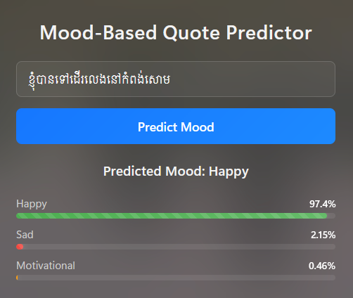

# Khmer Mood Predictor

A lightweight Flask web application that predicts the emotional tone of Khmer text using a simple AI model. Input a single Khmer sentence (10 words or fewer) to receive a mood prediction: **Happy**, **Sad**, or **Motivational**.

## Features

- Accepts Khmer text input
- Analyzes emotional tone using AI
- Outputs a mood label (**Happy**, **Sad**, or **Motivational**)
- Optimized for single sentences under 10 words

## Tech Stack

- **Python**: Core programming language
- **Flask**: Web framework for the application
- **AI Model**: Custom logic trained on 600+ Khmer sentences
- **HTML/CSS**: Frontend interface

# Model Performance Metrics

This section summarizes the performance of the Khmer Mood Predictor model, evaluated on a test dataset. The model predicts emotional tones (**Happy**, **Sad**, **Motivational**) for Khmer text inputs.

## Key Metrics

- **Final Test Accuracy**: 94.92%
- **Best Validation Accuracy**: 97.47%
- **Average Cross-Validation Accuracy**: 91.27%
- **Best Predicted Mood**: Sad

## Classification Report

The classification report details the model's performance across each mood class, including precision, recall, and F1-score, along with support (number of samples per class).

| Mood         | Precision | Recall | F1-Score | Support |
| ------------ | --------- | ------ | -------- | ------- |
| Happy        | 0.96      | 0.91   | 0.93     | 53      |
| Motivational | 0.95      | 0.99   | 0.97     | 77      |
| Sad          | 0.94      | 0.94   | 0.94     | 67      |

### Summary Statistics

- **Overall Accuracy**: 94.92% (197 samples)
- **Macro Average**:
  - Precision: 0.95
  - Recall: 0.94
  - F1-Score: 0.95
- **Weighted Average**:
  - Precision: 0.95
  - Recall: 0.95
  - F1-Score: 0.95

## Notes

- The model performs best on the **Motivational** class, with the highest recall (0.99) and F1-score (0.97).
- The **Sad** mood was the best-predicted overall, likely due to balanced precision and recall.
- Cross-validation results indicate robust generalization, though the average CV accuracy (91.27%) is slightly lower than the test accuracy.

## Setup and Installation

1. **Clone the repository**:

   ```bash
   git clone https://github.com/phalchanouksa/Khmer-Sentences-Mood-Based-Predictor
   cd Khmer-Sentences-Mood-Based-Predictor
   ```

2. **Install dependencies**:
   Ensure Python 3.8+ is installed, then run:

   ```bash
   pip install -r requirements.txt
   ```

3. **Run the application**:
   ```bash
   python app.py
   ```
   The app will start at `http://localhost:5000`.

## How to Use

1. **Access the app**:
   Open your browser and navigate to `http://localhost:5000`.

2. **Enter text**:
   Type a single Khmer sentence (10 words or fewer) into the provided text box.

3. **Submit**:
   Click the "Predict" button to analyze the text.

4. **View results**:
   The predicted mood (**Happy**, **Sad**, or **Motivational**) will display on the page.

**Example**:

- Input: "ខ្ញុំសប្បាយចិត្តណាស់ថ្ងៃនេះ។"
- Output: **Happy**

## Notes

- For best results, use concise sentences.
- The model is trained on a limited dataset (600+ sentences), so accuracy may vary.
- Ensure your system supports Khmer script rendering.
